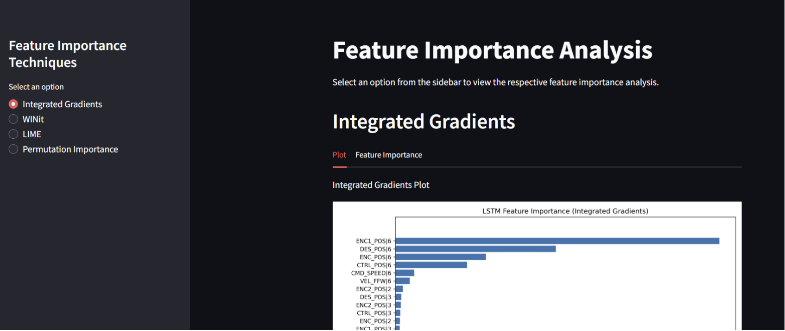

# Feature Importance in Time Series for CNC Machine Energy Consumption (XAI Benchmark + Streamlit App)

A Streamlit web app that lets you explore and compare **feature importance / explainability (XAI)** results for CNC machine energy consumption time series. The app presents **precomputed experiment outputs** comparing Integrated Gradients (IG), WINIT, LIME, and Permutation Importance (PI) across models and dataset variants (with/without correlation).

**Live app:** [https://featureimportance.streamlit.app](https://featureimportance.streamlit.app)  
**Portfolio write-up:** [Feature Importance (Time Series)](https://ranjith-mahesh-en.carrd.co/#feaimp)  
**University/Project:** Otto von Guericke University (OvGU) — Academic Project

## Why this project
Industrial energy time series are high-dimensional and context dependent, so the “most important” drivers can vary across machine type, material, and operating conditions.

This project focuses on:
- Making energy drivers transparent by benchmarking multiple XAI techniques.
- Comparing explanations across models and dataset settings (with/without correlation).
- Delivering results in an engineer-friendly UI without requiring local setup.

## What it does (3 views)
### 1) Technique Explorer
- Select an explainability technique (IG / WINIT / LIME / PI).
- View ranked feature importances and corresponding plots for selected scenarios.

### 2) Comparison Dashboard
- Compare techniques side-by-side using precomputed comparison plots and tables.
- Inspect differences across models and correlation settings (correlated vs non-correlated features).

### 3) Results & Downloads
- Browse experiment artifacts saved from batch runs (CSVs + plots).
- Use filenames/metadata to identify the model, technique, and correlation mode used for each output.

## Quick start (use the hosted app)
1. Open the app: [https://featureimportance.streamlit.app](https://featureimportance.streamlit.app)
2. Select a technique and scenario using the controls (no data upload required).
3. Explore plots/tables and compare methods across setups.

## Methods implemented (XAI)
- **Integrated Gradients (IG):** Gradient-based attributions for neural time series models (via Captum).
- **WINIT:** Time-series focused importance method to capture delayed/temporal effects.
- **LIME:** Local surrogate explanations for model-agnostic interpretability.
- **Permutation Importance (PI):** Global importance via performance drop after feature shuffling.

## Output
- Feature-importance rankings (Top-N features per scenario).
- Comparison plots/tables across techniques, models, and correlation settings.
- Stored experiment metrics (e.g., test loss, execution time) produced during offline runs.
<!--

-->
## Tech stack
- Python (data preprocessing, experiment orchestration, evaluation)
- Streamlit (interactive dashboard for exploring precomputed results)
- Pandas / NumPy (data wrangling and feature engineering)
- Matplotlib (plots saved as experiment artifacts)
- Scikit-learn (utility workflows and permutation importance)
- PyTorch (neural time-series models such as LSTM/FNN)
- Captum (Integrated Gradients for PyTorch models)
- LIME (local, model-agnostic explanations)

## Notes / limitations
- The deployed app is a results explorer (static artifact browser); experiments are computed offline and then published.
- Feature importance is sensitive to model choice, correlation structure, and data distribution—use comparisons to avoid over-trusting a single method.
- A future direction is a production pipeline for user dataset uploads + automated retraining and regenerated explanations (CI/CD style).
