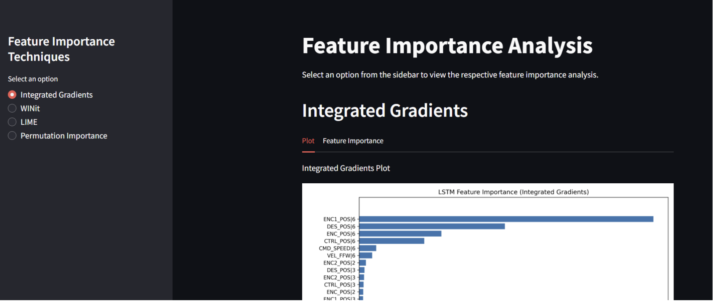

# Explainable AI for CNC Machine Energy Use (XAI Benchmark + Streamlit App)

Machine learning models that predict the energy consumption of CNC machines from time-series data, combined with a **benchmark of four explainable AI (XAI) methods** to show engineers *which factors actually drive energy use*. The results are published in an interactive Streamlit dashboard, so engineers can compare explanations without any local setup.

**Live app:** [featureimportance.streamlit.app](https://featureimportance.streamlit.app)  
**Portfolio:** [ranjith-mahesh.netlify.app](https://ranjith-mahesh.netlify.app/#projects)  
**University/Project:** Otto von Guericke University (OvGU) — Academic Project

## Key results

- **4 XAI methods benchmarked side by side:** Integrated Gradients, WINIT, LIME and Permutation Importance.
- **52 selected features** from CNC machine time-series data.
- **Robustness check:** explanations compared across models and across dataset variants with and without correlated features, showing where methods agree and where a single method could mislead.
- **Deployed:** results published as a live dashboard for engineers.

## Why this project
Industrial energy time series are high-dimensional and context dependent, so the “most important” drivers can vary across machine type, material, and operating conditions. A prediction alone doesn't help engineers act; they need to know *why* the model predicts what it does, and whether that explanation can be trusted.

This project focuses on:
- Making energy drivers transparent by benchmarking multiple XAI techniques.
- Testing how stable explanations are across models and correlation settings.
- Delivering results in an engineer-friendly UI without requiring local setup.

## How it works
1. **Data preparation:** CNC machine energy time series are cleaned, feature-engineered and prepared in two variants: with and without correlated features.
2. **Modeling:** several model families are trained to predict energy consumption, including XGBoost, Random Forest and neural time-series models (LSTM, FNN) in PyTorch.
3. **Explanation:** four XAI methods compute feature importance for the models and dataset variants (gradient-based Integrated Gradients for the neural models; model-agnostic methods such as LIME and Permutation Importance across model types).
4. **Artifacts:** batch runs store rankings, plots and metrics (test loss, execution time) as CSV and image files.
5. **Delivery:** a Streamlit dashboard loads these precomputed artifacts for exploration and comparison.

## What it does (3 views)
### 1) Technique Explorer
- Select an explainability technique (IG / WINIT / LIME / PI).
- View ranked feature importances and corresponding plots for selected scenarios.

### 2) Comparison Dashboard
- Compare techniques side-by-side using precomputed comparison plots and tables.
- Inspect differences across models and correlation settings (correlated vs non-correlated features).

### 3) Results & Downloads
- Browse experiment artifacts saved from batch runs (CSVs + plots).
- Use filenames/metadata to identify the model, technique, and correlation mode used for each output.

## Quick start (use the hosted app)
1. Open the app: [featureimportance.streamlit.app](https://featureimportance.streamlit.app)
2. Select a technique and scenario using the controls (no data upload required).
3. Explore plots/tables and compare methods across setups.

## XAI methods compared
- **Integrated Gradients (IG):** gradient-based attributions for neural time-series models (via Captum).
- **WINIT:** time-series–specific importance method that captures delayed and temporal effects.
- **LIME:** local surrogate explanations for model-agnostic interpretability.
- **Permutation Importance (PI):** global importance via the performance drop after shuffling a feature.

## Output
- Feature-importance rankings (Top-N features per scenario).
- Comparison plots/tables across techniques, models, and correlation settings.
- Stored experiment metrics (e.g., test loss, execution time) produced during offline runs.

## Tech stack
- **Machine learning:** XGBoost, Random Forest (scikit-learn), PyTorch (LSTM, FNN time-series models)
- **Explainable AI:** Captum (Integrated Gradients), LIME, WINIT, Permutation Importance
- **Data:** Python, Pandas, NumPy (preprocessing, feature engineering, experiment orchestration)
- **Visualization & app:** Matplotlib (experiment plots), Streamlit (interactive dashboard)
- **Deployment:** Streamlit Community Cloud (hosted live demo)

## Notes / limitations
- The deployed app is a results explorer; experiments are computed offline and then published.
- Feature importance is sensitive to model choice, correlation structure, and data distribution. Comparing methods avoids over-trusting a single one.
- Next step: a production pipeline for user dataset uploads with automated retraining and regenerated explanations (CI/CD style).
